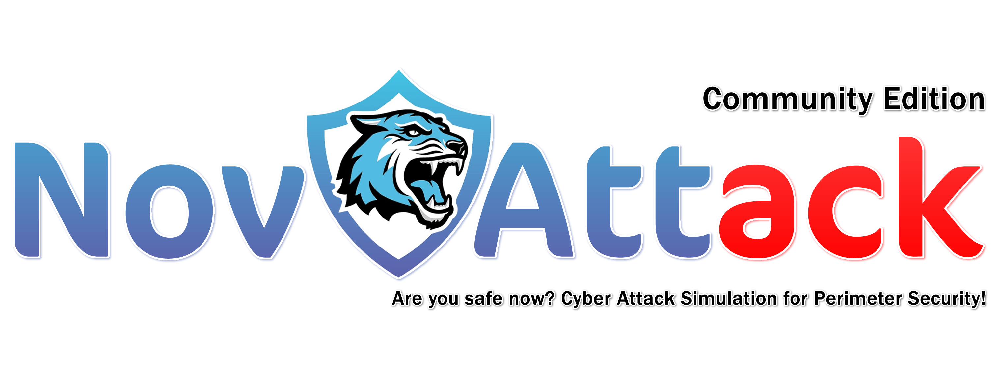

## Welcome to NovAttack

    

The NovAttack platform requires minimal setup time and few resources to implement. We love open source. So NovAttack is open source, it will remain open source.

NovAttack simulates real cyber attacks, focusing on the following attack categories.

## Features / Test Capabilities

- IPS / IDS / Firewall 
- Malware Download
- Content Filtering
- DLP (Data Loss Protection)
- WAF (Web Application Firewall) / Roadmap

## How does NovAttack work?

NovAttack advocates the open source philosophy. Uses the capabilities of python and libraries. All communication is prepared with API.

NovAttack simulates cyber attacks with its point-to-point connection. Thus, it reduces the amount of false positive. Attack vectors in it can be edited and updated.

- You can provide continuous cyber attack simulation by adding current malware to NovAttack.
- You can develop DLP vectors specific to your organization, such as credit card leak). NovAttack provides continuous analysis for you.
- You can test your institution's content or URL filter.

## Supporters

If you want to be added to this list, we are waiting for your support. You can contact us at info@novattack.com.

| Mustafa Altinkaynak | Ömer Faruk Er | Recep Tiryaki |
|---------------------|---------------|---------------|
